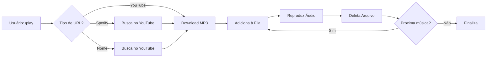

# VAI DJ

<div align="center">


**Um bot de música para Discord com suporte a YouTube e Spotify**

[Recursos](#-recursos) • [Instalação](#-instalação) • [Comandos](#-comandos) • [Configuração](#-configuração)

</div>

---

## Sobre o Projeto

**VAI DJ** é um bot de música para Discord que permite reproduzir suas músicas diretamente em canais de voz. Com suporte para **YouTube** e **Spotify**, o bot oferece sistema de filas, playlists e controles intuitivos.

### Principais Funcionalidades

- **Reprodução de Músicas do YouTube** - Suporte completo para vídeos e playlists
- **Integração com Spotify** - Toca músicas e playlists do Spotify (busca equivalentes no YouTube)
- **Busca por Nome** - Digite o nome da música e o bot encontra automaticamente
- **Sistema de Filas** - Gerenciamento inteligente de múltiplas músicas
- **Arquivos Locais** - Reproduza arquivos MP3 armazenados localmente
- **Gerenciamento Automático de Arquivos** - Deleta arquivos após reprodução para economizar espaço
- **Interface Rica** - Embeds com informações detalhadas das músicas
- **Processamento Paralelo de Playlists** - Download e reprodução otimizados

---

## Recursos

### Fontes de Música Suportadas

| Plataforma | Músicas Individuais | Playlists | Status |
|------------|---------------------|-----------|--------|
| **YouTube** | ✅ | ✅ | Funcional |
| **Spotify** | ✅ | ✅ | Funcional |
| **Arquivos Locais (MP3)** | ✅ | ➖ | Funcional |

### Comandos Disponíveis

| Comando | Descrição | Exemplo |
|---------|-----------|---------|
| `/play [url/nome]` | Toca música do YouTube, Spotify ou busca por nome | `/play never gonna give you up` |
| `/local [arquivo]` | Toca arquivo MP3 local | `/local minha_musica` |
| `/skip` | Pula para a próxima música | `/skip` |
| `/stop` | Para a reprodução e desconecta | `/stop` |
| `/pause` | Pausa a música atual | `/pause` |
| `/resume` | Retoma a reprodução | `/resume` |
| `/queue` | Mostra a fila de músicas | `/queue` |
| `/list` | Lista arquivos MP3 locais disponíveis | `/list` |
| `/stopplaylist` | Para processamento de playlist em andamento | `/stopplaylist` |

---

## Instalação

### Pré-requisitos

- **Node.js** 20.18.1 ou superior ([Download](https://nodejs.org/))
- **FFmpeg** instalado no sistema ([Download](https://ffmpeg.org/download.html))
- **yt-dlp** (incluído no projeto)
- Uma **aplicação Discord** criada no [Discord Developer Portal](https://discord.com/developers/applications)

### Passo a Passo

1. **Clone o repositório**
```bash
git clone https://github.com/Ransev0/VAI-DJ.git
cd VAI-DJ
```

2. **Instale as dependências**
```bash
npm install
```

3. **Baixe o yt-dlp**
   - Windows: Baixe `yt-dlp.exe` de [yt-dlp releases](https://github.com/yt-dlp/yt-dlp/releases)
   - Coloque o arquivo na raiz do projeto

4. **Configure as variáveis de ambiente**

Crie um arquivo `.env` na raiz do projeto:

```env
TOKEN=seu_token_do_bot_aqui
CLIENT_ID=id_da_aplicacao_aqui
GUILD_ID=id_do_servidor_aqui
```

5. **Execute o bot**
```bash
npm start
```

---

## Configuração

### Obtendo as Credenciais do Discord

#### 1. TOKEN (Token do Bot)

1. Acesse o [Discord Developer Portal](https://discord.com/developers/applications)
2. Crie uma nova aplicação ou selecione uma existente
3. Vá para a seção **Bot** no menu lateral
4. Clique em **Reset Token** e copie o token gerado
5. **IMPORTANTE:** Nunca compartilhe este token publicamente!

#### 2. CLIENT_ID (ID da Aplicação)

1. No Developer Portal, selecione sua aplicação
2. Na página **General Information**
3. Copie o **Application ID**

#### 3. GUILD_ID (ID do Servidor)

1. No Discord, ative o **Modo Desenvolvedor**:
   - Configurações → Avançado → Modo Desenvolvedor
2. Clique com o botão direito no seu servidor
3. Selecione **Copiar ID do Servidor**

### Convidando o Bot

Use este link para convidar o bot ao seu servidor (substitua `CLIENT_ID`):

```
https://discord.com/api/oauth2/authorize?client_id=CLIENT_ID&permissions=36700672&scope=bot%20applications.commands
```

**Permissões necessárias:**
- Conectar em canais de voz
- Falar em canais de voz
- Enviar mensagens
- Incorporar links
- Adicionar reações

---

## Uso

### Exemplos Práticos

#### Tocando Música do YouTube

```
/play https://www.youtube.com/watch?v=dQw4w9WgXcQ
```

#### Tocando do Spotify

```
/play https://open.spotify.com/track/0DiWol3AO6WpXZgp0goxAV
```

#### Buscando por Nome

```
/play bohemian rhapsody
```

#### Adicionando Playlist

```
/play https://www.youtube.com/playlist?list=...
```

#### Tocando Arquivo Local

```
/local minha_musica_favorita
```

---

## Arquitetura do Projeto

```
vai-dj/
├── index.js              # Arquivo principal do bot
├── package.json          # Dependências e configurações
├── .env                  # Variáveis de ambiente (não versionado)
├── .gitignore           # Arquivos ignorados pelo Git
├── yt-dlp.exe           # Utilitário para download (não versionado)
├── musicas/             # Pasta para arquivos MP3 (não versionada)
│   └── *.mp3
└── README.md            # Este arquivo
```

### Tecnologias Utilizadas

- **[Discord.js](https://discord.js.org/)** v14 - Framework para bots Discord
- **[@discordjs/voice](https://discord.js.org/docs/packages/voice/stable)** - Sistema de voz
- **[yt-dlp](https://github.com/yt-dlp/yt-dlp)** - Download de mídia
- **[axios](https://axios-http.com/)** - Requisições HTTP
- **[FFmpeg](https://ffmpeg.org/)** - Processamento de áudio
- **[dotenv](https://www.npmjs.com/package/dotenv)** - Gerenciamento de variáveis de ambiente

---

## Como Funciona

### Fluxo de Reprodução



### Sistema de Gerenciamento de Arquivos

O bot implementa um sistema de gerenciamento de arquivos:

1. **Download sob demanda**: Arquivos são baixados apenas quando solicitados
2. **Limpeza automática**: Após reprodução, arquivos MP3 são automaticamente deletados
3. **Economia de espaço**: Mantém apenas arquivos locais permanentes na pasta `musicas/`
4. **Processamento paralelo**: Playlists são processadas com até 3 músicas simultaneamente

---

## Desenvolvimento

### Estrutura do Código

#### Classes Principais

**`FinalMusicBot`**: Gerencia toda lógica de reprodução

```javascript
- connect()           // Conecta ao canal de voz
- addSong()          // Adiciona música à fila
- playNext()         // Toca próxima música
- stop()             // Para reprodução
- skip()             // Pula música
- pause() / resume() // Controles de reprodução
```

#### Funções de Processamento

- `downloadYouTubeAudio()` - Baixa áudio do YouTube
- `getPlaylistInfo()` - Extrai informações de playlists
- `getSpotifyTrackInfo()` - Obtém metadados do Spotify
- `searchYouTubeByName()` - Busca músicas por nome

---

## Resolução de Problemas

### Problemas Comuns

#### "Bot não conecta ao canal de voz"

**Solução:**
- Verifique se o bot tem permissões de **Conectar** e **Falar**
- Certifique-se de que você está em um canal de voz
- Verifique se o FFmpeg está instalado

#### "Erro ao baixar música"

**Solução:**
- Atualize o `yt-dlp.exe` para a versão mais recente
- Verifique sua conexão com a internet
- Alguns vídeos podem ter restrições regionais

#### "Comandos não aparecem"

**Solução:**
- Aguarde alguns minutos (Discord pode levar tempo para atualizar)
- Expulse e reenvite o bot
- Verifique se o `GUILD_ID` está correto no `.env`

### Debug

Para ver logs detalhados, o bot já inclui diversos `console.log` que mostram:
- Status de conexão
- Downloads em andamento
- Erros detalhados
- Estado da fila

---

## Notas Importantes

### Segurança

- **NUNCA** compartilhe seu arquivo `.env` ou token do bot
- Adicione `.env` ao `.gitignore`
- Se expor seu token acidentalmente, regenere-o imediatamente no Discord Developer Portal

### Direitos Autorais

- Este bot é apenas para uso pessoal/educacional
- Respeite os direitos autorais ao reproduzir músicas
- Não use para fins comerciais sem as devidas licenças

### Espaço em Disco

- O bot deleta arquivos automaticamente após reprodução
- Apenas arquivos na pasta `musicas/` são mantidos permanentemente
- Playlists grandes não ocupam espaço permanente

---

## Contribuindo

Contribuições são bem-vindas! Siga estas etapas:

1. Faça um Fork do projeto
2. Crie uma branch para sua feature (`git checkout -b feature/NovaFuncionalidade`)
3. Commit suas mudanças (`git commit -m 'Adiciona nova funcionalidade'`)
4. Push para a branch (`git push origin feature/NovaFuncionalidade`)
5. Abra um Pull Request

---

## Licença

Este projeto está sob a licença **MIT**. Veja o arquivo [LICENSE](LICENSE) para mais detalhes.

---

## Agradecimentos

- [Discord.js](https://discord.js.org/) - Framework
- [yt-dlp](https://github.com/yt-dlp/yt-dlp) - Ferramenta essencial
- Comunidade Discord.js - Suporte e documentação

---

## Contato

Encontrou um bug? Tem uma sugestão? Abra uma [issue](https://github.com/Ransev0/vai-dj/issues)!

---

<div align="center">

**Feito com ❤️ e muita música 🎵**

⭐ Se este projeto te ajudou, considere dar uma estrela!

</div>
